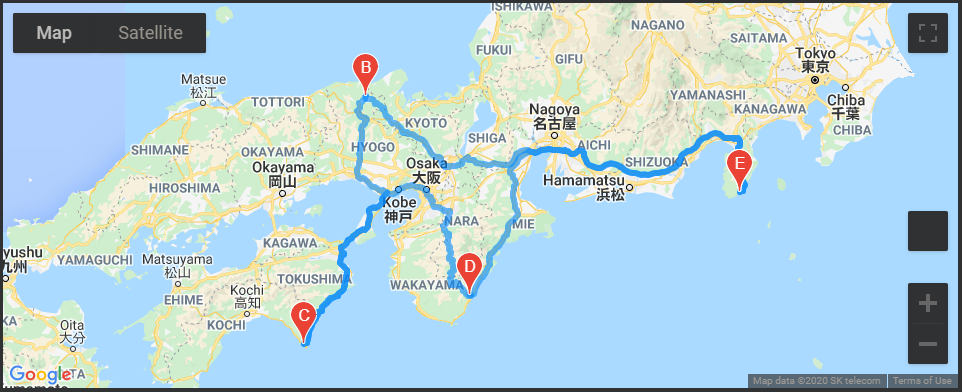
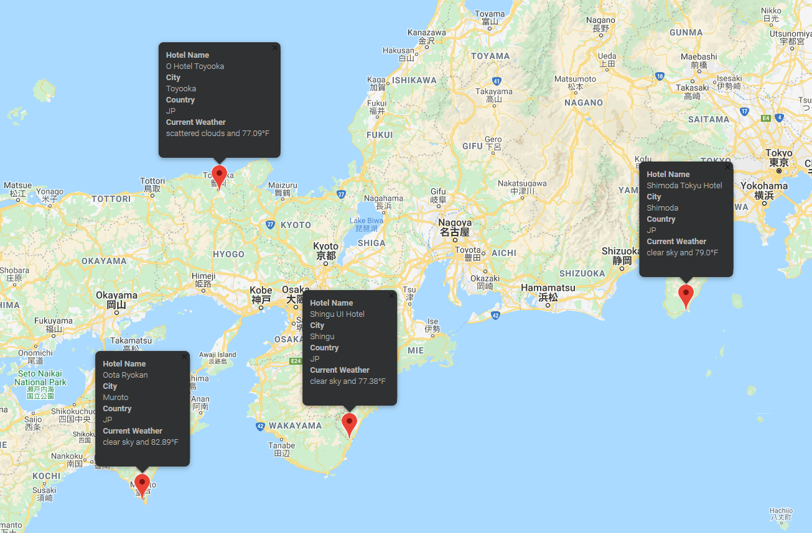

# World Weather Analysis

## Project Overview
Jack, the head of analysis for the user interface team for PlanMyTrip, a top travel technology company that specialises in internet related services in the hotel and lodging industry has asked for assistance in collecting and presenting data for customers via the search page. Customers will then filter based on their preferred travel criteria in order to find their ideal hotel anywhere in the world. After initial testing, a few changes were recommended to take the app to the next level. Below are the recommendations:

1. Adding the weather description to the weather data.
2. Incorporate input statements to filter the data for users' weather preferences, which will be used to identify potential travel destinations and nearby hotels.
3. From the list of potential travel destinations, the user will choose four cities to create a travel itinerary. Finally, using the Google Maps Directions API, a travel route between the four cities as well as a marker layer map will be created.

## Resources
- Data Source: WeatherPy_Database.csv, WeatherPy_vacation.csv
- Software: Python 3.7.7, Jupyter Notebook
- APIs: OpenWeatherMap, Google Places Nearby Search, Google Directions

## Summary
### Weather Database
The NumPy random module was used to generate 2000 latitude and longitude pairs (coordinates). Then, the citiPy module and the OpenWestherMap API was used to find the nearest city of those coordinates and the current weather data, respectively. After retrieving the data, it was converted into a Pandas DataFrame and exported as a csv file.

### Vacation Search
Input statements were incorporated to filter the data based on the users' minimum and maximum travel temperature preferences. Any rows with missing data were then dropped, and a new DataFrame is generated with Hotel names within 5,000 metres of the city using the Google Directions API to retrieve JSON data from the search. Once again, rows with missing Hotel names were dropped and exported into a csv file, generating a more refined DataFrame. A Google Map with markers was plotted using the jupyter-gmaps module to show some cities within the search criteria.

Google Map with Map Markers of Hotel, City, and Current Weather information.

 
 
### Vacation Itinerary
Four cities were then selected from the map to create an itinerary of travel destinations. The Google Directions API was used to generate route directions from the first city through the fourth city, ending at the start city.

Round Trip Route of the four cities chosen.

 
 

Chosen Travel Destination Cities with Map Markers.

